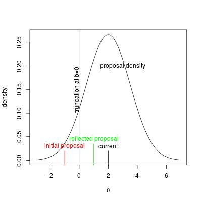

```{r chunksetup, include=FALSE} 
# include any code here you don't want to show up in the document,
# e.g. package and dataset loading
library(methods)  # otherwise new() not being found 
library(nimble)
library(coda)
source('occupancy_setup.R')
```

# Introduction

NIMBLE allows you to write your own sampler and use it in combination with NIMBLE's built-in samplers.

If you've developed a new MCMC sampling algorithm or want to try out an algorithm from the literature, you may want to combine it with standard samplers.

Or for someone with a specific model, you might want to do some very specific sampling approach for one or a few parameters in your model and rely on NIMBLE's built-in samplers for the rest of the model.

Here we'll see an illustration of how to do this.

# The reflection sampler

Suppose you have a parameter with a finite domain, in particular a fixed lower bound, such as a gamma distribution, a uniform distribution, or a lognormal distribution.

A standard Metropolis sampler could propose a value that is below the lower bound. This would give a probability density for the proposed value that is zero so the proposal would be rejected. That's fine, but it wastes the computation involved in proposing the value and determining that it should be rejected. If the current value of the parameter under consideration is near the bound, this will happen nearly 50% of the time. 

Instead, we can use *reflection*. If the proposed $\theta^\prime < b$ where $b$ is the bound, simply set $\theta^\prime$ to $b + (b-\theta^\prime)$

<center></center>


# Writing a nimbleFunction for the reflection sampler

The *run* function for the reflection sampler needs to check the proposed value against the distribution bounds and modify the proposal as needed.

However, we first need to modify the *setup* function to check if the distribution has finite lower or upper bounds and only consider scalar parameters, thereby avoiding some computation at run-time. 

```{r, reflect-sampler}
RW_reflect <- nimbleFunction(
    contains = sampler_BASE,
    setup = function(model, mvSaved, target, control) {
        ## Some checking...
        targetComponents <- model$expandNodeNames(target,
            returnScalarComponents = TRUE)
        if(length(targetComponents) > 1)
            stop("RW_reflect: cannot use univariate RW sampler on multivariate target, try RW_block sampler.")

        ## Is the reflection sampler appropriate?
        dist <- model$getDistribution(target)
        rg <- getDistributionInfo(dist)$range
        if(rg[[1]] > -Inf || rg[[2]] < Inf)
                  reflect <- TRUE else reflect <- FALSE

        calcNodes  <- model$getDependencies(target)
    },
    
    run = function() {
        propValue <- rnorm(1, mean = model[[target]], sd = scale)

        if(reflect) {
            lower <- model$getBound(target, 'lower')
            upper <- model$getBound(target, 'upper')
             if(propValue < lower) propValue <- 2*lower - propValue
             if(propValue > upper) propValue <- 2*upper - propValue
        }
 
        model[[target]] <<- propValue
        ## Calculate difference of log posterior relative to previous value (which has been saved).
        logMHR <- calculateDiff(model, calcNodes) 
        jump <- decide(logMHR)
        if(jump)
            nimCopy(from = model, to = mvSaved, row = 1, nodes = calcNodes, 
                         logProb = TRUE)
        else
            nimCopy(from = mvSaved, to = model, row = 1, nodes = calcNodes, 
                         logProb = TRUE)
    },
    methods = list(
            reset = function () {}
            )
)
```


Comment: We used some functionality that may not be fully explained in NIMBLE's documentation. For this sort of thing, you can always ask a question in the NIMBLE users Google group. 

# NIMBLE's Metropolis sampler

Often it's easiest when writing a new sampler that is similar to an existing NIMBLE sampler to just modify the code for the existing sampler. In this case, NIMBLE's existing random walk sampler has some nice additional functionality that we can include in our reflection sampler, specifically the ability to adapt the proposal variance. 


Below is the full new reflection sampler, building on NIMBLE's baseline random walk sampler to include adaptation. (You can see all of our sampler nimbleFunctions in the file *R/MCMC_samplers.R* in the [NIMBLE source package](https://cran.r-project.org/src/contrib/nimble_0.9.0.tar.gz), also available as `MCMC_samplers.R` in this repository.)


```{r, newSampler}
RW_reflect <- nimbleFunction(
    contains = sampler_BASE,
    setup = function(model, mvSaved, target, control) {
        ## control list extraction
        logScale      <- if(!is.null(control$log))
                      control$log else FALSE
        reflective    <- if(!is.null(control$reflective))
                      control$reflective else FALSE
        adaptive      <- if(!is.null(control$adaptive))
                      control$adaptive else TRUE
        adaptInterval <- if(!is.null(control$adaptInterval))
                      control$adaptInterval else 200
        scale         <- if(!is.null(control$scale))
                      control$scale else 1
        ###  node list generation  ###
        targetAsScalar <- model$expandNodeNames(target, 
                       returnScalarComponents = TRUE)
        if(length(targetAsScalar) > 1)     
                       stop('more than one target; cannot use RW sampler, try RW_block sampler')
        if(model$isDiscrete(target))
                       stop('cannot use RW sampler on discrete-valued target; try slice sampler')

        ### ADDED code ############################################
        dist <- model$getDistribution(target)
        rg <- getDistributionInfo(dist)$range
        if(rg[[1]] > -Inf || rg[[2]] < Inf)
                  reflect <- TRUE else reflect <- FALSE
        ###########################################################

        calcNodes  <- model$getDependencies(target)
        ###  numeric value generation  ###
        scaleOriginal <- scale
        timesRan      <- 0
        timesAccepted <- 0
        timesAdapted  <- 0
        scaleHistory          <- c(0, 0)
        acceptanceRateHistory <- c(0, 0)
        optimalAR <- 0.44
        gamma1    <- 0
    },
    
    run = function() {
        propValue <- rnorm(1, mean = model[[target]], sd = scale)

        ### ADDED code ############################################
        if(reflect) {
            lower <- model$getBound(target, 'lower')
            upper <- model$getBound(target, 'upper')
             if(propValue < lower) propValue <- 2*lower - propValue
             if(propValue > upper) propValue <- 2*upper - propValue
        }
        ###########################################################

        model[[target]] <<- propValue
        logMHR <- calculateDiff(model, calcNodes)
        jump <- decide(logMHR)
        if(jump)
            nimCopy(from = model, to = mvSaved, row = 1, nodes = calcNodes, 
                         logProb = TRUE)
        else
            nimCopy(from = mvSaved, to = model, row = 1, nodes = calcNodes, 
                         logProb = TRUE)
        if(adaptive)     adaptiveProcedure(jump)
    },
    
    methods = list(
        
        adaptiveProcedure = function(jump = logical()) {
            timesRan <<- timesRan + 1
            if(jump)     timesAccepted <<- timesAccepted + 1
            if(timesRan %% adaptInterval == 0) {
                acceptanceRate <- timesAccepted / timesRan
                timesAdapted <<- timesAdapted + 1
                setSize(scaleHistory,          timesAdapted)
                setSize(acceptanceRateHistory, timesAdapted)
                scaleHistory[timesAdapted] <<- scale
                acceptanceRateHistory[timesAdapted] <<- acceptanceRate
                gamma1 <<- 1/((timesAdapted + 3)^0.8)
                gamma2 <- 10 * gamma1
                adaptFactor <- exp(gamma2 * (acceptanceRate - optimalAR))
                scale <<- scale * adaptFactor
                timesRan <<- 0
                timesAccepted <<- 0
            }
        },
        
        reset = function() {
            scale <<- scaleOriginal
            timesRan      <<- 0
            timesAccepted <<- 0
            timesAdapted  <<- 0
            scaleHistory          <<- scaleHistory          * 0
            acceptanceRateHistory <<- acceptanceRateHistory * 0
            gamma1 <<- 0
        }
    ), where = getLoadingNamespace()
)

```

# Using the sampler

Using the sampler is simple. Just modify the default MCMC configuration for a model to use the new sampler on a node of interest.

Let's try this with an extension of the occupancy model we've been using. We'll put a random effect for each sampling occasion, $j=1,\ldots,J$. For example this could represent variability across different people doing the sampling.


```{r, occ_extended}
occ_code_ext <- nimbleCode({
  # Priors
  mean.p ~ dunif(0, 1)         # Detection intercept on prob. scale
  alpha0 <- logit(mean.p)      # Detection intercept
  alpha1 ~ dunif(-20, 20)      # Detection slope on wind
  mean.psi ~ dunif(0, 1)       # Occupancy intercept on prob. scale
  beta0 <- logit(mean.psi)     # Occupancy intercept
  beta1 ~ dunif(-20, 20)       # Occupancy slope on vegHt
  
  # Likelihood
  for (i in 1:M) {
    # True state model for the partially observed true state
    z[i] ~ dbern(psi[i])      # True occupancy z at site i
    logit(psi[i]) <- beta0 + beta1 * vegHt[i]
    for (j in 1:J) {
      # Observation model for the actual observations
      y[i,j] ~ dbern(p.eff[i,j])    # Detection-nondetection at i and j
      p.eff[i,j] <- z[i] * p[i,j]   # 'straw man' for WinBUGS
      logit(p[i,j]) <- alpha0 + alpha1 * wind[i,j] + b[j]
    }
  }
  # Random effects distribution
  for(j in 1:J)
      b[j] ~ dnorm(0, sd = sigma)
  sigma ~ dunif(0, 10)  ## Gelman (2006) says why inverse-gamma priors are a bad choice
}
)
```

Note that we did not use `b` when simulating the data, so `sigma = 0` is the true parameter value.

# Sampling without reflection

As a baseline, let's see the sampling without using the new sampler.

```{r, init_mcmc, fig.cap='', fig.width=12, fig.height=12}
set.seed(1)
occ_model <- nimbleModel(occ_code_ext,
                        constants = occupancy_data, 
                        inits = c(inits_saved, 'sigma' = 0.25))

occ_MCMC <- buildMCMC(occ_model)

Cocc_model <- compileNimble(occ_model)
Cocc_MCMC <- compileNimble(occ_MCMC, project = occ_model)

samples <- runMCMC(Cocc_MCMC, niter = 2500, nburnin = 500)

plot(as.mcmc(samples))
```

# Sampling with reflection


```{r, scopefix, echo=FALSE, fig.cap='', fig.width=5, fig.height=5}
# not clear why RW_reflect() not being put into global
# if this isn't done, configureMCMC fails to find sampler_RW_reflect in knitr
assign('RW_reflect', RW_reflect, .GlobalEnv)
```

Now we'll use the reflection sampler we just created.

```{r, refl_mcmc, fig.cap='', fig.width=12, fig.height=12}
set.seed(1)
conf <- configureMCMC(occ_model)
conf$removeSamplers('sigma')
conf$addSampler('sigma','RW_reflect')
occ_MCMC_refl <- buildMCMC(conf)
Cocc_MCMC_refl <- compileNimble(occ_MCMC_refl, project = occ_model, resetFunctions = TRUE)
samples_refl <- runMCMC(Cocc_MCMC_refl, niter = 2500, nburnin = 500)

plot(as.mcmc(samples_refl))

```

# Required arguments and methods for a sampler `nimbleFunction`

- It must contain the argument `contains = sampler_BASE`.

    - (This is a simple class inheritance system that mimic's R's *contains* argument.)

- The *setup* function must take the arguments *model*, *mvSaved*, *target*, and *control*.

    - *model* is the model being sampled.
    - *mvSaved* is a length-one *modelValues* object that keeps an up-to-date copy of all model values, including log probabilities.
    - *target* is a vector of node names to be sampled.
    - *control* is a list that can contain whatever elements you want.

- The *run* function (method) must execute the sampler.

- The *reset* method must reset the sampler if that means anything for the particular sampler.

    - Example: An adaptive sampler would reset its proposal distribution.


# Required behavior of a sampler:

- Upon entry, the sampler can assume that `mvSaved[[1]]` contains a complete copy of the model's variables, including logProb variables.

- The sampler may do whatever it wants (assuming it is valid for MCMC) in its *run* function, including modifying values of model variables, including logProb variables.

- Upon exiting the *run* function, `mvSaved[[1]]` must again contain a complete copy of the model's variables, including logProb variables.

    - The `mvSaved[[1]]` is like the "current" state of the model.
    - The *run* function puts proposed values in the model and does appropriate calculations.
    - If the proposal is rejected: copy from `mvSaved[[1]]` to the model.
    - If the proposal is accepted: copy from the model to `mvSaved[[1]]`.

